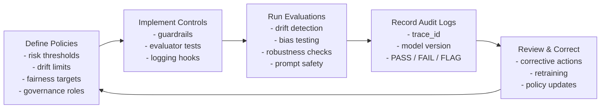

# 🔁 AI Governance Lifecycle

The AI Governance Framework follows a **closed-loop lifecycle** that aligns with:

- **NIST AI RMF** → Map → Measure → Manage → Govern  
- **ISO/IEC 42001** → Plan → Do → Check → Act  
- **EU AI Act (2026)** → Risk Management → Data Governance → Logging → Oversight

This lifecycle ensures every AI system is **auditable, safe, compliant, and continuously monitored**.

---

## 🔄 1. Governance Lifecycle Diagram



---

## 🔍 2. Phase Descriptions

### **1. Define Policies**
Owned by: **Compliance, Legal, Privacy, Enterprise Architecture**  
Artifacts:  
- `policies.yaml`  
- Risk register  
- Governance scorecard  
- Accountability matrix  

### **2. Implement Controls**
Owned by: **Engineering + Architecture**  
Controls include:  
- drift thresholds  
- fairness tests  
- PHI/PII detections  
- prompt governance rules  
- audit logging hooks  

### **3. Run Evaluations**
Performed automatically during:  
- training  
- deployment  
- inference  
- monitoring  
- incident reviews  

Evaluations generate **PASS / FAIL / FLAG** outcomes.

### **4. Record Audit Logs**
Artifacts stored in:  
- `AUDIT/`  
- JSON logs  
- model version lineage  
- traceability records  

Satisfies **EU AI Act Article 12** (logging) and **ISO 42001 continuous monitoring**.

### **5. Review & Correct**
Triggers:  
- failed tests  
- anomalies  
- safety concerns  
- budget exceedances  

Outputs:  
- corrective actions  
- updated policies  
- retraining decisions  

---

## 📂 File Structure

```
Governance/
    governance-lifecycle.md   ← This file
    risk-register-template.xlsx
    accountability-model.md
    governance-scorecard.md
```

---


