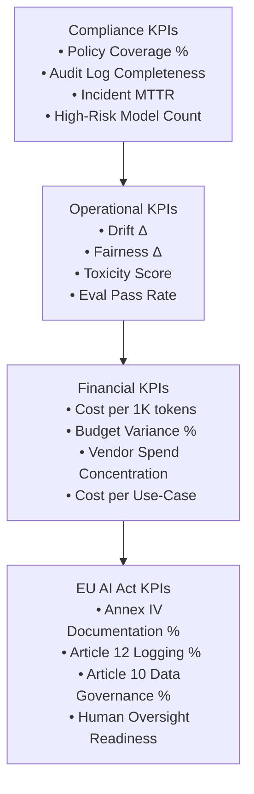

# 📊 AI Governance KPIs Dashboard

This dashboard defines the **enterprise-level KPIs** used to assess AI system health across:
- **Compliance**
- **Operational Risk**
- **Financial Governance**
- **Model Performance**
- **EU AI Act readiness (2026)**

KPIs map to:  
✔ NIST AI RMF — *Measure, Manage, Govern*  
✔ ISO/IEC 42001 — *Do, Check, Act*  
✔ EU AI Act — *Article 9, 10, 12, 14, Annex IV*

---

# 🔹 1. Executive KPI Table



---

# 🔹 2. KPI Definitions (Detailed)

## **A. Compliance KPIs**
| KPI | Description | Target |
|------|-------------|---------|
| **Policy Coverage %** | Portion of models mapped to policies.yaml | ≥ 90% |
| **Audit Log Completeness** | % of required metadata captured (trace_id, model_version, inputs, outputs) | ≥ 95% |
| **Compliance SLA** | Time taken to resolve flagged outputs | ≤ 48 hours |
| **High-Risk Model Count** | Number of models classified as high-risk (EU AI Act definition) | ↓ downward trend |

---

## **B. Operational KPIs**
| KPI | Description | Target |
|------|-------------|---------|
| **Drift Δ** | % deviation vs training distribution | ≤ 5% |
| **Fairness Δ** | Δ between protected groups (statistical parity / equalized odds) | ≤ 3% |
| **Toxicity Score** | % of outputs flagged as unsafe | ≤ 0.5% |
| **Evaluation Pass Rate** | Tests passed across fairness/drift/robustness | ≥ 95% |

---

## **C. Financial KPIs**
| KPI | Description | Target |
|------|-------------|---------|
| **Cost per 1K Tokens** | Normalized cost per LLM request | “Green band” defined per vendor |
| **Budget Variance %** | (Actual – Budget) / Budget | ± 10% |
| **Vendor Spend Concentration** | % spend with top vendor | ≤ 60% |
| **Cost per Use-Case** | Total cost / transactions | ↓ downward trend |

---

## **D. EU AI Act KPIs (2026)**
| KPI | Description | Target |
|------|-------------|---------|
| **Annex IV Documentation %** | Completion of technical documentation objects | ≥ 90% |
| **Article 12 Logging %** | Logging completeness | ≥ 95% |
| **Article 10 Data Governance** | Data lineage, quality, representativeness | ≥ 90% |
| **Human Oversight Readiness** | Oversight workflows implemented | 100% |

---

# 🔹 3. KPI Dashboard Files & Data Sources

```
assets/metrics/
    kpi-dashboard.png        ← visuals (optional)
    drift-metrics.json
    fairness-metrics.json
    costs-summary.csv
    audit-log-samples/
```

---

# 🔹 4. Update Frequency

- **Compliance KPIs:** weekly  
- **Operational KPIs:** daily (automated)  
- **Financial KPIs:** monthly (CFO reporting)  
- **EU AI Act KPIs:** quarterly  

---

# 🔹 5. Ownership

| Category | Owner |
|----------|--------|
| Compliance KPIs | Legal, Privacy, Compliance |
| Operational KPIs | Engineering + Architecture |
| Financial KPIs | Finance (CFO), PMO |
| EU AI Act KPIs | Compliance + Enterprise Architecture |

---


