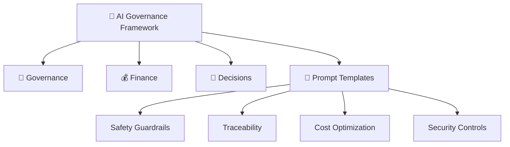

# 🧭 AI Governance Framework

> **Public Sample Repository – non-confidential templates for enterprise AI governance.**

**Enterprise-level governance and financial oversight framework** for responsible AI adoption across regulated industries.  
This repository complements the technical layers of [trustgate-evals](https://github.com/skatwala/trustgate-evals), [trustgate-fastapi](https://github.com/skatwala/trustgate-fastapi), and [compliance-ai-reference-arch](https://github.com/skatwala/compliance-ai-reference-arch).

It demonstrates how AI systems can be deployed **with traceability, accountability, and fiscal discipline** — the foundations of enterprise trust.

---

## 📂 Structure
| Folder | Description |
|--------|--------------|
| **Governance/** | Regulation trackers, risk registers, and operating model templates |
| **Finance/** | Budget playbooks, architecture cost models |
| **Decisions/** | Executive memos and decision logs for AI oversight |
| **prompt_templates/** | Safety, traceability, cost, and security blueprints for LLM prompt governance |

---

## 🧩 Prompt Governance Patterns
Safe, traceable, and cost-aware **prompt templates** designed for regulated AI deployments (healthcare, finance, and HR).  
Each template enforces *compliance-by-design* principles — safety guardrails, full traceability, cost transparency, and embedded security controls.

| File | Purpose |
|------|----------|
| [`safety-guardrails.md`](./prompt_templates/safety-guardrails.md) | Defines red-lines for responsible responses (e.g., “do not diagnose,” “defer to professional”). |
| [`traceability.md`](./prompt_templates/traceability.md) | Establishes trace IDs, model provenance, and logging patterns for audit readiness. |
| [`cost-optimization.md`](./prompt_templates/cost-optimization.md) | Provides a tiered model-switching and caching framework to manage LLM costs. |
| [`security-controls.md`](./prompt_templates/security-controls.md) | Implements prompt-level defenses against injection, PII leakage, and misuse. |

> **Usage:**  
> Integrate these templates into your LLM orchestration layer or prompt management system.  
> Each file serves as a *governance artifact* that can be reviewed by compliance, security, or audit teams.  
> All prompts should reference a unique `trace_id` and adhere to these controls for safe, consistent deployment.

---

## 🪜 Visual Overview

---

## 📫 Connect
- [LinkedIn](https://www.linkedin.com/in/saptarshi-katwala/)
- 📧 skatwala@gmail.com

> “AI systems don’t fail on accuracy alone — they fail on trust.  
> This framework builds the **trust layer** that lets enterprises scale safely.”
