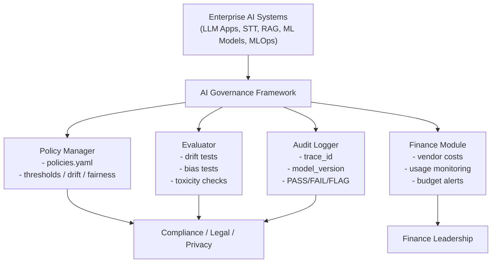

# 🧱 AI Governance Framework — Architecture Specification

## 1. Purpose

This document defines the **end-to-end architecture** of the AI Governance Framework.  
It connects:

- **Policies → Controls**  
- **Controls → Mechanisms**  
- **Mechanisms → Audit Trails**  
- **Audit Trails → Compliance Reporting**

The framework is aligned with:

- **NIST AI RMF v1.0**  
- **ISO/IEC 42001:2023**  
- **EU AI Act (2026)**  
- **HIPAA, GDPR, GxP (where applicable)**

Its goal is to provide a **repeatable, audit-ready risk management layer** across all AI systems in the enterprise.

---

## 2. High-Level Architecture (Conceptual)

---

## 3. Component Breakdown

### 3.1 Policy Manager
- Loads `policies.yaml`  
- Defines governance controls (drift %, bias deltas, robustness thresholds)  
- Owned jointly by: **Compliance + Enterprise Architecture**

### 3.2 Evaluator
Runs measurable checks on:
- fairness  
- drift  
- toxicity / prompt safety  
- robustness  
- hallucination score  

Outputs → `PASS / FAIL / FLAG`

### 3.3 Audit Logger
- Immutable logs  
- `trace_id`, timestamp, model version  
- JSON + machine-readable format  
- Satisfies **EU AI Act Article 12** on logging

### 3.4 Finance Module
Implements:
- vendor cost models  
- per-request cost tracking  
- budget guardrails  
- alerts  

Aligned with **CFO reporting** and **ISO 42001 continuous monitoring**.

---

## 4. Integration Points

### 4.1 LLM Gateways (FastAPI/Async)
- Trace ID injection  
- Prompt governance controls  
- Retry/backoff  
- Cost attribution  

### 4.2 Databricks / MLOps Pipelines
- Model version lineage  
- Drift signals emitted to Evaluator  
- Delta-based audit history  

### 4.3 RAG / Retrieval Pipelines
- Document governance  
- Data quality score  
- PHI/PII screening logs  

---

## 5. Governance-by-Design

Governance hooks applied at:
- data ingestion  
- model training  
- model deployment  
- prompt execution  
- monitoring & incident management  

This fulfills:
- NIST: **Map → Measure → Manage → Govern**  
- ISO 42001: **Plan → Do → Check → Act**  
- EU AI Act: **Risk Management → Data Governance → Logging → Human Oversight**

---

## 6. Versioning

Architecture is versioned using semantic tags:

- `architecture-v1.0` — Baseline governance  
- `architecture-v1.1` — Added prompt governance lifecycle  
- `architecture-v2.0` — EU AI Act alignment  

See `CHANGELOG.md` for details.

---

